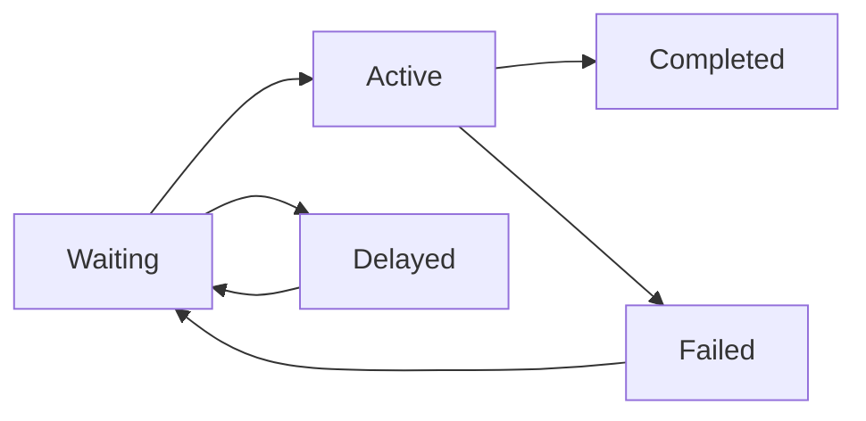

bullstudio automatically discovers all BullMQ queues in your connected Redis instance and provides tools to monitor and manage them.

## Queue List

The queue list shows all discovered queues with their current status and job counts.

### Queue Information

| Column | Description |
|--------|-------------|
| **Name** | The queue name as defined in your BullMQ code |
| **Status** | Current queue state (Active, Paused) |
| **Waiting** | Jobs waiting to be processed |
| **Active** | Jobs currently being processed |
| **Completed** | Successfully processed jobs |
| **Failed** | Jobs that failed processing |
| **Delayed** | Jobs scheduled for future processing |

<Info>
  Job counts reflect the current state in Redis. Use the refresh button to update counts.
</Info>

## Job Statuses Explained

BullMQ jobs move through various states during their lifecycle:



| Status | Description |
|--------|-------------|
| **Waiting** | Job is in the queue, ready to be picked up by a worker |
| **Active** | Job is currently being processed by a worker |
| **Completed** | Job finished successfully |
| **Failed** | Job threw an error during processing |
| **Delayed** | Job is scheduled to run at a future time |
| **Paused** | Queue is paused; jobs won't be picked up |
| **Waiting-children** | Job is waiting for child jobs to complete |

## Queue Operations

### Pause Queue

Pausing a queue stops workers from picking up new jobs. Jobs already being processed will complete, but no new jobs will start.

<Steps>
  <Step title="Select the queue">
    Click on the queue you want to pause.
  </Step>
  <Step title="Click Pause">
    Click the **Pause** button in the queue actions.
  </Step>
  <Step title="Confirm">
    The queue status will change to **Paused**.
  </Step>
</Steps>

<Warning>
  Pausing a queue does not stop currently processing jobs. They will complete normally.
</Warning>

**Use cases for pausing:**
- Deploying new worker code
- Investigating issues without new jobs starting
- Performing maintenance on dependent services

### Resume Queue

Resuming a paused queue allows workers to start picking up jobs again.

<Steps>
  <Step title="Select the paused queue">
    Click on the queue showing **Paused** status.
  </Step>
  <Step title="Click Resume">
    Click the **Resume** button.
  </Step>
  <Step title="Verify">
    The queue status will return to **Active** and workers will resume processing.
  </Step>
</Steps>

## Real-Time Updates

Queue information updates in real-time:

- Job counts refresh automatically
- Status changes appear immediately
- New queues are discovered automatically

## Filtering Queues

If you have many queues, use the search/filter to find specific ones:

- Search by queue name
- Filter by status (Active, Paused)

## Queue Best Practices

### Naming Conventions

Use descriptive, consistent queue names:

```javascript
// Good - descriptive and consistent
const emailQueue = new Queue('email-notifications');
const paymentQueue = new Queue('payment-processing');
const reportQueue = new Queue('report-generation');

// Avoid - generic or inconsistent
const queue1 = new Queue('queue1');
const q = new Queue('q');
```

### Separate Queues by Priority

Consider using separate queues for different job priorities:

```javascript
const highPriorityQueue = new Queue('orders-high-priority');
const normalQueue = new Queue('orders-normal');
const lowPriorityQueue = new Queue('orders-low-priority');
```

### Monitor Queue Depth

Keep an eye on the **Waiting** count:

- Consistently growing waiting jobs may indicate not enough workers
- Sudden spikes may indicate upstream issues flooding the queue
- Set up [backlog alerts](/features/alerts) to get notified

## Access Modes

Your connection's access mode affects what operations you can perform:

| Operation | Read-Write | Read-Only |
|-----------|-----------|-----------|
| View queues | Yes | Yes |
| View job counts | Yes | Yes |
| Pause queue | Yes | No |
| Resume queue | Yes | No |

<Tip>
  Use Read-Only mode for production connections where you only want to monitor, not modify.
</Tip>

## Next Steps

<Columns cols={2}>
  <Card title="Job Management" icon="list-check" href="/features/job-management">
    Browse and manage individual jobs.
  </Card>
  <Card title="Dashboard" icon="chart-line" href="/features/dashboard">
    View queue metrics and analytics.
  </Card>
  <Card title="Alerts" icon="bell" href="/features/alerts">
    Set up notifications for queue issues.
  </Card>
</Columns>
