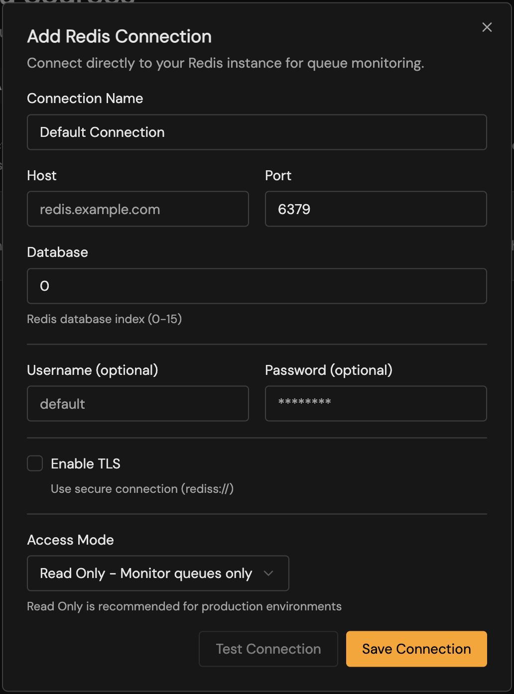

The simplest way to connection your redis instance, is to connect bullstudio directly. To direct connect, navigate to the **Connections** tab and select **Direct redis** from the available tabs. 

<Note>
    It is highly recommend to use TLS.
</Note>

