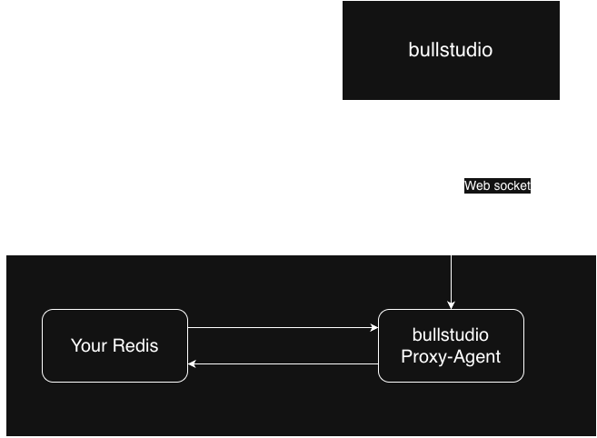
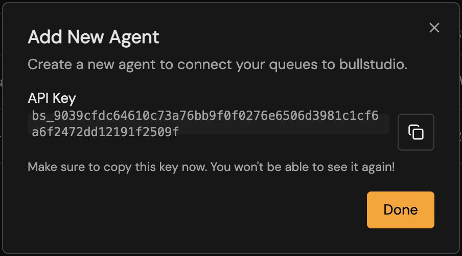
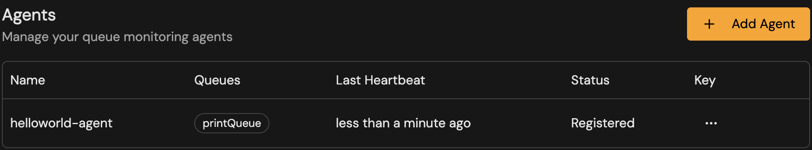

If you cannot connect to you redis instance directly (for example because it is running locally or in a private network), you can use a proxy agent to connect bullstudio to your redis instance. The proxy agent is a small command line tool that connects to your redis instance and forwards the queue and job data to bullstudio via web socket. The image below shows how the connection works:



## Generate an agent key
To use a proxy agent you first need to generate an agent key in bullstudio. To do this, go to the **Connections** page, navigate to **SDK Agents** tab and click **Add Agent**. You will be prompted to enter a name for your agent, after which an agent key will be generated. Copy this key as you will need it to run the proxy agent.



## Test locally
To run the proxy agent locally via NPX run the following command:

```bash
npx @bullstudio/proxy-agent --agent-key <AGENT_KEY> --redis-host <REDIS_HOST> --redis-port <REDIS_PORT> 
```
Replace `<AGENT_KEY>`, `<REDIS_HOST>`, and `<REDIS_PORT>` with your agent key, redis host, and redis port respectively. This will start the proxy agent and connect it to your redis instance. Available options can be found by running:

```bash
npx @bullstudio/proxy-agent --help
```

## Docker
Coming soon...

## Viewing status
After starting the proxy agent, you can view its status in bullstudio by going to the **Connections** page and navigating to the **SDK Agents** tab. Here you will see your agent listed along with its connection status.

